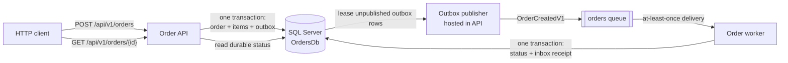

# Azure Bus Service

See the [HTTP API contract](docs/api-contract.md) for client-facing behavior, the [system architecture](docs/architecture.md) for system boundaries, the [messaging reliability guide](docs/messaging-reliability.md) for Outbox, Service Bus, Inbox, retry, and dead-letter behavior, and the [infrastructure guide](docs/infrastructure.md) for topology, configuration, storage, startup, and troubleshooting.

.NET 10 order API and queue worker demonstrating durable asynchronous processing with SQL Server, a transactional outbox/inbox, and Azure Service Bus. Docker Compose provides local SQL Server 2022, Microsoft Azure Service Bus Emulator 2.0.1, and optional API/worker containers; applications can instead run directly on the host.

## Architecture



The API accepts an order only after storing the order, items, and versioned message in one SQL transaction. Its background publisher leases outbox rows, sends stable message IDs, and marks successful publication. The worker validates the envelope, settles messages manually, and commits its inbox receipt with the order update in a serializable transaction. SQL inbox deduplication makes repeated broker delivery safe.

Service Bus send and SQL publication marking are not one distributed transaction. Duplicate delivery remains possible by design; the outbox and inbox provide at-least-once reliability.

> **Queue ownership rule:** one queue represents one consumer workflow. The `orders` queue belongs to `AzureBusService.Worker`; do not create queues per HTTP endpoint or attach unrelated competing consumers to it.

## Project layout

```text
src/
  AzureBusService.Api/          Minimal API, outbox publisher, health, telemetry, Dockerfile
  AzureBusService.Worker/       Service Bus processor, inbox, health, telemetry, Dockerfile
  AzureBusService.Contracts/    OrderCreatedV1 message contract
  AzureBusService.Persistence/  EF Core runtime mappings and persistence entities
database/migrations/            Forward-only SQL schema scripts
database/local/                 Local-only SQL login provisioning
infra/servicebus/               Local emulator entity configuration
scripts/                        Infrastructure, migration, reset, and test helpers
tests/                          API, worker, and end-to-end test projects
compose.yaml                    Infrastructure plus optional `apps` profile
```

## Prerequisites

- [.NET 10 SDK](https://dotnet.microsoft.com/download/dotnet/10.0). `global.json` requests `10.0.100` and rolls forward to its latest patch.
- Docker with Compose v2 (`docker compose`), such as Docker Desktop.
- `curl` for the examples.
- Enough Docker resources for the selected Compose stack.

### macOS on Apple silicon

SQL Server is pinned to `linux/amd64` in `compose.yaml`; it is not a native ARM image. Docker runs it through x86-64 emulation, which starts more slowly and uses more resources. Enable Docker Desktop's Rosetta/x86-64 emulation support if startup fails. `scripts/start-infra.sh` waits for both SQL and the emulator rather than assuming they are ready immediately.

## Local quick start

Run commands from the repository root.

### 1. Start infrastructure

```sh
./scripts/start-infra.sh
```

This starts SQL Server, Service Bus Emulator, and a one-shot emulator health gate. API and worker services remain disabled unless the optional Compose `apps` profile is selected.

### 2. Apply SQL migrations

```sh
./scripts/migrate.sh
```

The script creates `OrdersDb` when needed, applies every numbered production migration under `database/migrations/` in numeric order, then runs `database/local/app_login.sql` to provision the fixed local-only application login.

### 3. Run the API

In a separate terminal:

```sh
dotnet run --project src/AzureBusService.Api --launch-profile http
```

API base URL: `http://localhost:5126`

### 4. Run the worker

In another terminal:

```sh
ASPNETCORE_URLS=http://localhost:5127 \
  dotnet run --project src/AzureBusService.Worker --launch-profile AzureBusService.Worker
```

Worker health base URL: `http://localhost:5127`

Development settings use the local SQL login and emulator connection string. Anonymous API access works only because local configuration explicitly sets `Authentication__Enabled=false` and `Authentication__AllowAnonymousLocal=true`; keep this mode local and emulator-only. Orders belong to the `anonymous` owner in this mode.

### Optional: run everything in containers

As an alternative to the host-run steps above:

```sh
./scripts/start-all.sh
```

The script starts infrastructure, applies migrations, builds the API and worker images, starts the Compose `apps` profile, and waits for both applications' liveness and readiness endpoints. Defaults:

- API: `http://localhost:5080`
- Worker health: `http://localhost:5081`

Both Dockerfiles use multi-stage .NET 10 builds and chiseled ASP.NET runtime images. Final containers run as the non-root .NET application user. Override host ports with `API_PORT` and `WORKER_PORT` in a root `.env` file.

### Default ports

| Component | Port | Address or purpose |
|---|---:|---|
| SQL Server | 1433 | `localhost,1433` |
| Service Bus emulator | 5672 | AMQP endpoint |
| Emulator management/health | 5300 | `http://localhost:5300/health` |
| API, host-run HTTP profile | 5126 | `http://localhost:5126` |
| API, host-run HTTPS profile | 7140 | `https://localhost:7140` |
| Worker, host-run | 5127 | Set explicitly by the host-run command above |
| API, Compose `apps` profile | 5080 | `http://localhost:5080`; configurable with `API_PORT` |
| Worker, Compose `apps` profile | 5081 | `http://localhost:5081`; configurable with `WORKER_PORT` |

Infrastructure ports can be overridden with the variables documented in `.env.example`. Docker Compose reads a root `.env` file automatically; .NET applications do not.

Every published Compose port binds to `127.0.0.1` only; SQL, emulator, API, and worker are not exposed on other host interfaces.

## Use the API

Examples below use the host-run API on port `5126`. Use port `5080` after `scripts/start-all.sh`.

### Create an order

Exactly one `Idempotency-Key` header is required.

```sh
curl --include --request POST http://localhost:5126/api/v1/orders \
  --header 'Content-Type: application/json' \
  --header 'Idempotency-Key: demo-order-001' \
  --data '{
    "customerId": "10000000-0000-0000-0000-000000000001",
    "currency": "USD",
    "items": [
      {
        "productId": "20000000-0000-0000-0000-000000000001",
        "quantity": 2,
        "unitPrice": 12.50
      }
    ]
  }'
```

Successful creation returns `202 Accepted`, `Location: /api/v1/orders/{orderId}`, and `Retry-After: 1`. The JSON response contains the same status URL and starts at `Pending`.

### Poll status and use ETags

Copy the order ID from the create response:

```sh
ORDER_ID='<orderId>'
ORDER_URL="http://localhost:5126/api/v1/orders/$ORDER_ID"

curl --include "$ORDER_URL"
```

A `200 OK` response includes an `ETag`. Preserve the surrounding quotes and send it on the next poll:

```sh
ETAG='"<value from the ETag response header>"'
sleep 1
curl --include "$ORDER_URL" --header "If-None-Match: $ETAG"
```

- `304 Not Modified`: status has not changed; no response body.
- `200 OK`: status changed; save the new `ETag` for the next poll.
- Active statuses (`Pending`, `Queued`, or `Processing`) also return `Retry-After: 1`.

With authentication enabled, both endpoints require a bearer token. Ownership is a SHA-256 key derived from the exact, case-sensitive JWT `iss` and `sub` strings, separated before hashing; the same `sub` from different issuers is a different owner. Looking up another owner's order returns `404`.

## Order lifecycle

```text
Pending -> Queued -> Processing -> Completed
   |          |           |
   +----------+-----------+-> Failed
```

| Status | Meaning |
|---|---|
| `Pending` | Order and outbox message committed to SQL. |
| `Queued` | Outbox publisher sent the message and recorded publication. |
| `Processing` | Worker began processing. |
| `Completed` | Worker committed the inbox receipt and final order state. Terminal. |
| `Failed` | Publication or processing reached a terminal failure. Terminal. |

Polling may skip intermediate states. The worker records `Processing` and `Completed` inside one transaction, and queue delivery can race with the publisher's SQL update. Invalid messages, forged metadata, and failed provenance checks are dead-lettered without mutating an order. Processing exceptions for a valid message are abandoned until the fifth delivery; retry exhaustion can then fail its order and dead-letter the message as `MaxDeliveryCountExceeded`.

## Idempotency and delivery semantics

### HTTP creation

- Header is trimmed, must be non-empty, must appear exactly once, and is limited to 128 characters.
- Uniqueness scope is `(owner key, idempotency key)`. Authenticated owner keys hash the exact JWT `iss` + `sub` identity; explicitly enabled local anonymous requests use owner `anonymous`.
- First request atomically creates one order and one outbox message.
- Repeating the key with an equivalent normalized payload returns `202` with the original order ID and creation time. UUID formatting, decimal formatting, and item order do not change the request fingerprint.
- Reusing the key with a different payload returns `409 Conflict`.
- The SQL unique index enforces the rule under concurrent requests. Keys remain reserved while their order row exists.

### Message delivery

- Broker delivery is at least once, with manual completion, abandonment, and dead-letter settlement.
- Stable outbox message IDs plus emulator duplicate detection reduce short-window duplicates.
- Before processing, the worker enforces a 256 KiB body limit; validates contract, schema, message/order/correlation envelope agreement; and validates IDs, UTC timestamp, currency, item count and uniqueness, quantity, decimal scale/range, and computed total.
- A valid contract must also match a persisted, unquarantined outbox row by message ID, order, contract, schema, and serialized payload. Validation or provenance failures are dead-lettered without changing order state.
- The durable `orders.InboxMessages` primary key is the authoritative worker deduplication check. A previously committed message is completed without applying the order transition again.
- Published outbox rows are deleted after seven days. Inbox receipts are retained for 30 days by default; the worker cleans them immediately at startup and then hourly in batches of up to 500. Configure a positive retention period with `Inbox__RetentionDays`.

## Database and migrations

Application schema comes from forward-only SQL scripts, not EF-generated migrations. EF Core supplies runtime mappings only.

| Script | Contents |
|---|---|
| `database/migrations/001_initial_schema.sql` | Only numbered production migration: `infra.SchemaVersions`; `orders.Orders`, `OrderItems`, `OutboxMessages`, and `InboxMessages`; constraints and indexes. Uses a SQL application lock and transaction. |
| `database/local/app_login.sql` | Local-only provisioning, run after migrations by `scripts/migrate.sh`: fixed `orders_app_local` login, `OrdersAppRole`, object grants, and `SELECT` on `infra.SchemaVersions`. Not a production migration. |

Production migrations record applied versions in `infra.SchemaVersions`, so rerunning `scripts/migrate.sh` is safe for the current scripts. Both applications require the latest recorded version to equal version 1 and refuse startup when it differs. Applications validate the schema but never apply migrations themselves. Add future changes as new numeric, forward-only scripts rather than editing an applied production migration.

Production credentials or identities must be provisioned separately; never run the fixed local login script in production. Grant each principal only operations it needs. The local aggregate role grants `SELECT/INSERT/UPDATE` on `orders.Orders`, `SELECT/INSERT` on `orders.OrderItems`, `SELECT/INSERT/UPDATE/DELETE` on `orders.OutboxMessages`, `SELECT/INSERT/DELETE` on `orders.InboxMessages`, and required `SELECT` on `infra.SchemaVersions` for startup enforcement.

SQL application data persists in the `sql-data` Docker volume across normal Compose stops.

> **Destructive reset:** `./scripts/reset.sh --yes` permanently deletes the local SQL volume, restarts infrastructure, and reapplies migrations. It cannot recover existing orders, outbox rows, or inbox receipts.

## Tests

Default test run:

```sh
dotnet test --solution AzureBusService.sln
```

Current API and worker tests are fast source-level tests for request validation and fingerprinting, ETags, transitions, retries, message envelopes, and worker validation. The end-to-end test is discovered but skipped by default unless `RUN_END_TO_END_TESTS=true`.

Docker-backed full-test entry point:

```sh
./scripts/test-all.sh
```

`test-all.sh` starts infrastructure, applies migrations, defaults `RUN_END_TO_END_TESTS=true`, supplies the `E2E_*` connections, then runs the full solution. Arguments are forwarded to `dotnet test`, for example:

```sh
./scripts/test-all.sh --configuration Release
```

`AcceptedOrderIsProcessedToCompletion` launches the built API and worker on temporary local ports, waits for readiness, creates an order, and polls until `Completed`. End-to-end tests run sequentially. The full Docker-backed infrastructure-to-API-to-queue-to-worker-to-SQL flow has been validated.

## Health, OpenAPI, and telemetry

| Process | Endpoint | Meaning |
|---|---|---|
| API | `/alive` | Process liveness; no dependency checks. |
| API | `/health` | SQL readiness. |
| Worker | `/alive` | Process liveness; no dependency checks. |
| Worker | `/health` | SQL connectivity and a Service Bus queue peek. |
| API, Development only | `/openapi/v1.json` | Generated OpenAPI document. |

Both processes write structured JSON logs to the console. OpenTelemetry tracing and metrics instrument HTTP/runtime activity plus custom API outbox and worker message instruments. No telemetry is exported unless `OTEL_EXPORTER_OTLP_ENDPOINT` is set:

```sh
OTEL_EXPORTER_OTLP_ENDPOINT=http://localhost:4317 \
  dotnet run --project src/AzureBusService.Api --launch-profile http
```

Use the same environment variable for the worker. Traces, metrics, and logs then use the OTLP exporter. There is no built-in dashboard or Prometheus `/metrics` endpoint.

## Emulator and Azure configuration

Transport mode is explicit and validated at startup. There is no fallback from Azure to the emulator or from the emulator to Azure.

### Emulator mode

Development settings configure both processes with:

```text
Authentication__Enabled=false
Authentication__AllowAnonymousLocal=true
ServiceBus__Mode=Emulator
ServiceBus__QueueName=orders
ServiceBus__ConnectionString=Endpoint=sb://localhost;SharedAccessKeyName=RootManageSharedAccessKey;SharedAccessKey=SAS_KEY_VALUE;UseDevelopmentEmulator=true;
```

Authentication settings apply to the API. Anonymous access requires both values shown and must remain local/emulator-only. The literal SAS value is an emulator placeholder, not a production credential.

### Azure mode

Supply production settings through environment variables or a managed secret/configuration provider:

```text
ConnectionStrings__Orders=<production SQL connection string>
ServiceBus__Mode=Azure
ServiceBus__QueueName=orders
ServiceBus__FullyQualifiedNamespace=<namespace>.servicebus.windows.net
```

In Azure mode, both processes construct `ServiceBusClient` with `DefaultAzureCredential`; they do not use a Service Bus connection string. For a future Kubernetes deployment, configure Azure Workload Identity for each service account and assign only required Service Bus data-plane roles: sender access to the API identity and receiver access to the worker identity. Workload identity setup and role assignments are not supplied by this repository. Current SQL access still comes from `ConnectionStrings__Orders`.

Production API authentication is also explicit:

```text
Authentication__Enabled=true
Authentication__AllowAnonymousLocal=false
Authentication__Authority=<OIDC authority>
Authentication__Audience=<API audience>
```

The API refuses startup when authentication is enabled without both values. `TrustedProxies__KnownIPs__0`, `__1`, and so on may be set when forwarded headers should be accepted from known proxies.

### Worker inbox retention

`Inbox__RetentionDays` controls how long processed-message deduplication receipts remain in SQL. Default is `30`; the worker rejects zero or negative values at startup. Cleanup runs immediately and then hourly using batches of up to 500 rows.

### Emulator boundaries

The emulator is a local development aid, not full Azure Service Bus parity. It does not validate cloud networking, Microsoft Entra authentication, RBAC, managed identity, availability, scaling, or Azure operational behavior. Treat broker entities and messages as non-persistent test state; do not rely on them surviving emulator/container restarts. This differs from application SQL data, which has a named Docker volume.

The checked-in `orders` queue configuration is:

- Default message TTL: 1 hour; expired messages are dead-lettered.
- Duplicate-detection history window: 5 minutes.
- Lock duration: 1 minute; worker auto-renewal is bounded at 5 minutes.
- Maximum delivery count: 5.
- Sessions disabled; no topics configured.

The five-minute broker duplicate window is only supplementary protection. SQL inbox deduplication remains necessary after that window and in Azure.

## Secrets and deferred scope

- Values in `.env.example`, development settings, and `database/local/app_login.sql` are fixed **local-only** credentials. Never reuse them outside an isolated development machine.
- Never commit production connection strings, passwords, SAS keys, tokens, certificates, or workload identity material. Root `.env` is ignored by Git; use environment variables or an approved secret store.
- Keep `ServiceBus:ConnectionString` emulator-only. Prefer identity-based Azure mode for future production.
- Keep anonymous API mode emulator/local-only and opt in explicitly with `Authentication__AllowAnonymousLocal=true`; production should use JWT authentication and leave it `false`.

Kubernetes manifests, cloud IaC, production database identity/credential provisioning, CI pipelines, UI/dashboard work, and automated dead-letter replay are deliberately deferred. Dead-letter queue inspection, diagnosis, and replay remain manual: inspect the `orders` dead-letter subqueue with Service Bus tooling or SDK code, correct the cause, and explicitly republish approved messages. No inspection or replay command is included in this project.
