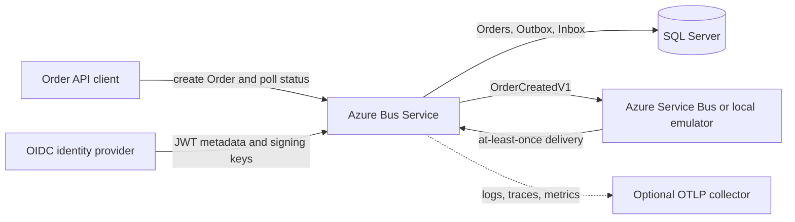
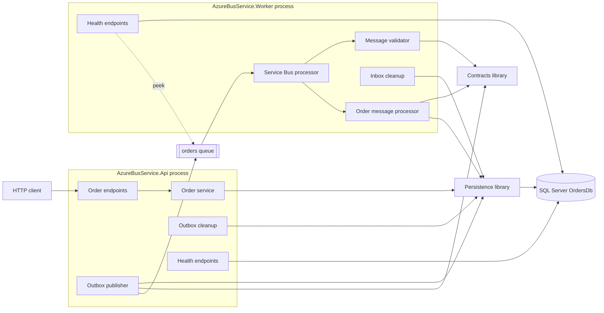
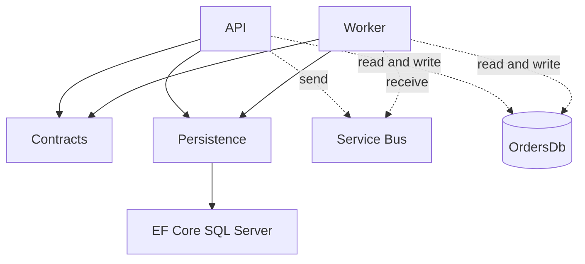
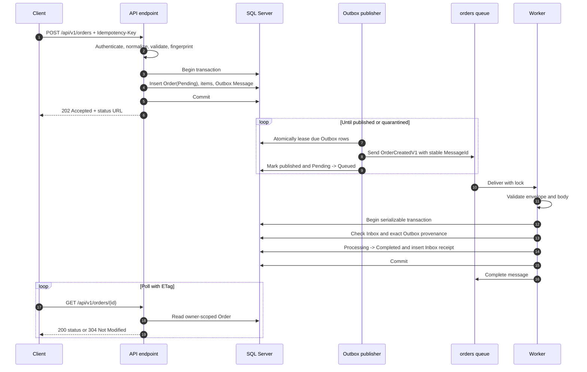
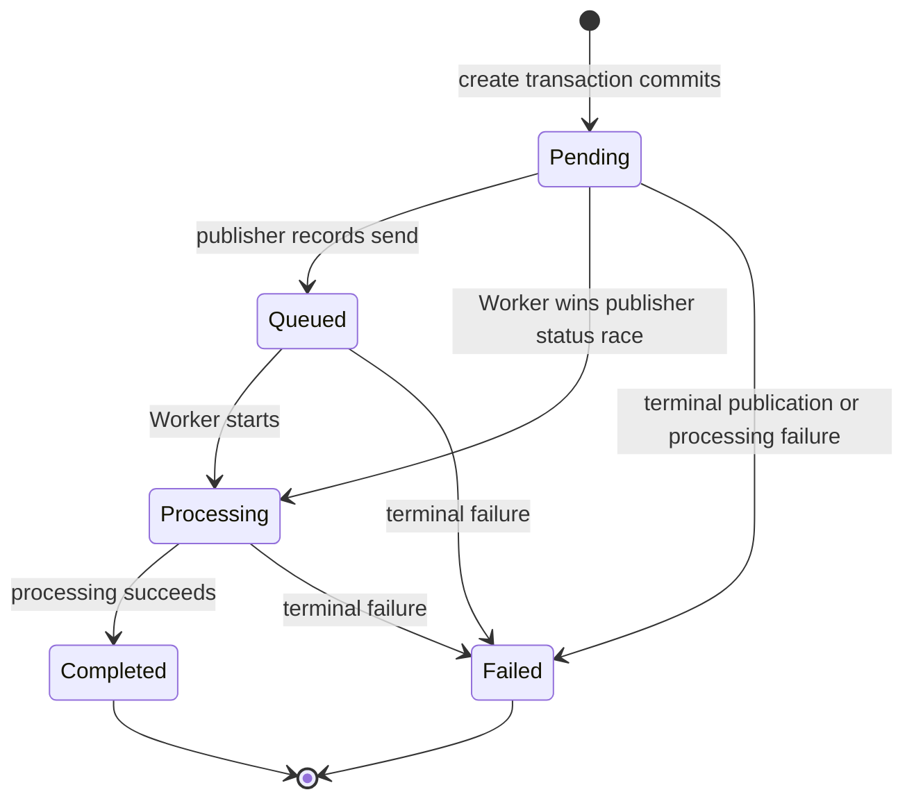

# System architecture

This document describes the architecture implemented in this repository. It is
not a target-state design. For local topology, startup, configuration, ports,
storage, and troubleshooting, use the [infrastructure guide](infrastructure.md).
For original scope and implementation decisions, see the
[foundation specification](azure-service-bus-order-processing-foundation-spec.md).

## Purpose

Azure Bus Service is a .NET 10 reference service for accepting an Order over
HTTP, durably queuing it for asynchronous work, and exposing its durable status.
It demonstrates the failure handling needed between SQL Server and Azure
Service Bus without using a distributed transaction.

The implemented business operation is deliberately small: the Worker validates
an `OrderCreatedV1` message and changes the Order to `Completed`. It does not
call a fulfillment, payment, inventory, or other external business system.

## Quality attributes

| Attribute | Implemented approach |
|---|---|
| Durability | The API commits the Order, items, and Outbox Message to SQL before returning `202 Accepted`. |
| Delivery reliability | An Outbox Publisher retries transfer to Service Bus. Manual settlement and an Inbox support at-least-once delivery. |
| Idempotency | HTTP retries are keyed by owner and `Idempotency-Key`; message retries are keyed by the stable message ID. |
| Integrity | The Worker validates the envelope and body, then compares the message with its exact persisted Outbox provenance. |
| Isolation | Authenticated Order ownership is derived from the exact JWT issuer and subject. Cross-owner lookups return `404`. |
| Scalability | API publishers coordinate with SQL leases; Worker replicas compete on one queue with bounded per-process concurrency. |
| Operability | Both processes expose liveness/readiness, JSON logs, OpenTelemetry traces and metrics, and startup schema checks. |
| Local usability | Docker Compose supplies SQL Server and the Service Bus emulator; API and Worker may run on the host or in containers. |

These mechanisms provide durable acceptance and idempotent handling of normal
redelivery. They do not provide a global exactly-once guarantee.

## System context



The identity provider is involved only when API authentication is enabled.
There is no bundled identity provider or telemetry collector. SQL Server is the
system of record for Orders and processing status. Service Bus is a transport,
not the status authority.

## Containers and components



The Outbox Publisher and Outbox cleanup are hosted services inside every API
process. The Service Bus processor and Inbox cleanup are hosted services inside
every Worker process. They are not separately deployable binaries in the
current repository.

## Module responsibilities and dependency direction

### API

`AzureBusService.Api` owns the HTTP boundary:

- Validates request size, Order fields, and exactly one `Idempotency-Key`.
- Authenticates JWTs when enabled and derives the Order owner from exact `iss`
  and `sub` claim values. Explicit local anonymous mode uses owner `anonymous`.
- Applies an in-process token-bucket rate limit.
- Creates an Order, its items, and one Outbox Message atomically.
- Returns and reads owner-scoped status, including SQL `rowversion` ETags.
- Hosts Outbox publication, published-row cleanup, health endpoints, and API
  telemetry.

The request path never sends directly to Service Bus. Broker availability is
therefore not part of API readiness and does not prevent durable acceptance.

### Worker

`AzureBusService.Worker` owns the `orders` consumer workflow:

- Receives with manual settlement.
- Validates size, contract metadata, envelope/body identity, and business data.
- Verifies persisted Outbox provenance before successful Order processing.
- Performs the Order transition and inserts the Inbox receipt in one
  serializable SQL transaction.
- Completes duplicates as no-ops, abandons retryable failures, and dead-letters
  invalid or exhausted messages.
- Hosts Inbox cleanup, readiness checks, and Worker telemetry.

### Contracts

`AzureBusService.Contracts` defines the transport-neutral `OrderCreatedV1`
body and its item type. Contract name and schema version are constants in this
module. The contract is versioned independently from the `/api/v1` HTTP route.

Contracts has no project references. API and Worker both depend on Contracts;
Contracts depends on neither application.

### Persistence

`AzureBusService.Persistence` defines EF Core runtime mappings and persistence
entities for Orders, Order Items, Outbox Messages, and Inbox Messages. It also
contains the shared `OrderStatus` enum and exact schema-version startup check.

Persistence depends on the EF Core SQL Server provider, but not on API, Worker,
or Contracts. It does not create or migrate the schema. Forward-only SQL files
under `database/migrations/` own schema creation.

### SQL Server

SQL Server stores the authoritative application state:

- `orders.Orders` and `orders.OrderItems` hold accepted Orders.
- `orders.OutboxMessages` is the durable publication intent and message
  provenance record.
- `orders.InboxMessages` is the durable consumer deduplication record.
- `infra.SchemaVersions` records the applied schema version.

Both applications depend directly on the same `OrdersDb` schema. This shared
database is an intentional consistency boundary in the current implementation,
not a database-per-service architecture.

### Service Bus

Service Bus transports `OrderCreatedV1` from the API-hosted publisher to the
Worker. The API requires send access; the Worker requires receive and settlement
access. The queue is not queried for client-visible Order status.

### Dependency rules



- API and Worker do not reference or call each other.
- Contracts and Persistence do not reference either executable.
- Cross-process coordination occurs only through SQL Server and Service Bus.
- SQL status remains authoritative even when broker state is unavailable.

## End-to-end Order flow



Details important to interpreting this sequence:

1. The API returns only after the first SQL transaction commits.
2. Repeating the same owner/key and equivalent normalized payload returns the
   original Order. Reusing the key with a different fingerprint returns `409`.
3. A fast Worker can finish before the publisher records `Queued`. The guarded
   publisher update will not move `Completed` backward to `Queued`.
4. `Processing` and `Completed` are written inside one Worker transaction.
   Pollers normally observe `Pending` or `Queued` followed directly by
   `Completed`.
5. Broker completion occurs only after the Worker SQL transaction commits.

## Order status state machine



| Status | Owner and meaning |
|---|---|
| `Pending` | API creation transaction committed; publication is still unrecorded. |
| `Queued` | API-hosted publisher sent the message and committed its publication record. |
| `Processing` | Worker intermediate state. It is written in the same transaction as `Completed`, so it is normally not externally observable. |
| `Completed` | Worker committed the successful Order update and Inbox receipt. Terminal. |
| `Failed` | Publisher quarantined a permanent publication failure, or Worker processing exhausted retries and identified an active Order from a structurally valid message. Terminal. |

The Worker accepts `Pending`, `Queued`, or `Processing` as processable because
delivery can race with the publisher's SQL update. Publisher and Worker guards
prevent terminal states from regressing. No cancellation or reopening
transition exists.

## Transaction boundaries and crash outcomes

SQL and Service Bus do not participate in a shared transaction. Reliability
comes from small local transactions plus retry and deduplication.

| Boundary | Atomic work | Crash or failure outcome |
|---|---|---|
| API create | Insert Order, Order Items, and Outbox Message in one SQL transaction. | Before commit, nothing is accepted. After commit but before the HTTP response, a client retry with the same key finds the original Order. |
| Outbox claim | One SQL statement leases up to 100 due rows for one minute using `UPDLOCK`, `READPAST`, and row locks. | A crashed publisher leaves leases that become eligible after expiry. |
| Broker send | One Service Bus send using the Outbox ID as broker `MessageId`. | A failed send leaves the row retryable. SDK retries and capped, jittered Outbox scheduling handle transient errors. |
| Publication record | After send, a SQL transaction records `PublishedUtc`, clears the lease/failure fields, increments attempts, and changes eligible `Pending` Orders to `Queued`. | If send succeeded but this transaction did not commit, the row is sent again after retry or lease expiry. Duplicate publication is expected. |
| Permanent publication failure | One SQL transaction quarantines the Outbox row and changes an active Order to `Failed`. | Either both changes commit or neither does. Quarantined rows are not retried automatically. |
| Worker processing | One serializable SQL transaction checks Inbox, verifies Outbox provenance, updates the Order, and inserts the Inbox receipt. | Before commit, SQL changes roll back and the broker lock can expire or the message can be abandoned. After commit, the durable result and receipt survive. |
| Broker settlement | Complete or dead-letter occurs after the relevant SQL work. | If the Worker commits and crashes before completion, redelivery finds the Inbox receipt and completes without repeating the transition. |
| Retry exhaustion | On delivery 5, the Worker validates the envelope/body, marks its referenced active Order `Failed` in a serializable transaction, then dead-letters the message. This failure path does not repeat the Outbox provenance match. | If failure status commits but settlement does not, the next delivery sees a terminal Order and dead-letters it. |

Validation and provenance rejection do not mutate Order state. The Worker
dead-letters those messages with sanitized reasons. Exceptions before the fifth
delivery cause abandonment. The fifth-delivery threshold is implemented in the
Worker and matches the checked-in local queue configuration.

## Outbox, Inbox, and at-least-once semantics

### Outbox

The Outbox closes the API-to-broker durability gap. An accepted Order always has
a committed publication intent. Every API replica runs a publisher that:

1. Leases due, unpublished, unquarantined rows.
2. Constructs the broker message from the stored JSON and metadata.
3. Sends using the stable Outbox ID.
4. Marks success in a later SQL transaction, or schedules/quarantines failure.

The send and success mark are deliberately separate. Their ambiguity window is
why duplicate sends are possible. Published rows remain for seven days, then
API-hosted cleanup deletes them in batches.

### Inbox

The Inbox primary key is the message ID. Inside the same serializable
transaction as the Order update, the Worker checks this key and inserts the
receipt. A redelivery with an existing receipt is completed as a no-op.

Inbox receipts default to 30-day retention and are deleted in bounded batches
by every Worker process. Deduplication is therefore durable but retention
bounded. Broker duplicate detection is only an optimization; it does not replace
the Inbox.

### Guarantee

The implemented transport and consumer model is at least once:

- Accepted work remains in SQL while the broker is unavailable.
- Ambiguous sends and settlements may cause repeated delivery.
- Repeated delivery is safe for the implemented SQL effect while its Inbox
  receipt exists.
- No component claims exactly-once publication, global exactly-once processing,
  or guaranteed eventual business success.

Messages can expire or be dead-lettered, permanent publication errors can be
quarantined, and infrastructure can remain unavailable. Those outcomes require
operator action or leave the Order terminally failed; they are not hidden by
the at-least-once label.

## Message identity, traceability, and provenance

One UUID v7 message ID connects all reliability records:

```text
OutboxMessages.Id
  = OrderCreatedV1.messageId
  = ServiceBusMessage.MessageId
  = InboxMessages.MessageId
```

The contract also carries a separately generated Order ID and correlation ID.
The publisher places contract name, schema version, Order ID, and correlation
ID in Service Bus metadata. The Worker requires metadata and body identities to
agree before using the body.

After structural and business validation, the Worker loads the Outbox row by
message ID and requires all of the following:

- Matching Order ID.
- `OrderCreatedV1` contract name and schema version 1.
- An unquarantined Outbox record.
- Exact equality between stored JSON and serialization of the received body.

Only then may the message perform the successful processing transition. A
syntactically valid broker message without this SQL provenance is normally
dead-lettered. The retry-exhaustion exception path marks an Order failed from a
validated body ID without repeating this provenance check; this is called out as
a current limitation below. Provenance does not require `PublishedUtc`, because
the Worker can receive the send before the publisher records publication.

W3C `traceparent` and optional `tracestate` properties link the publisher span
to the Worker consumer span. The current Outbox does not store the original
HTTP trace context, so a later publication starts a new trace rather than a
durable continuation of the POST trace. The contract correlation ID remains
stable across storage and transport.

## Queue ownership and API/status boundary

### Queue ownership rule

The `orders` queue belongs to one consumer workflow:
`AzureBusService.Worker` Order processing. Worker replicas may compete for its
messages because they implement the same behavior. Do not create queues per
HTTP endpoint, and do not attach an unrelated consumer workflow as a competing
receiver. A future independent workflow would need its own delivery entity;
none is implemented here.

### API/status ownership boundary

- API owns caller authentication, owner isolation, request idempotency, Order
  creation, and the HTTP representation of status.
- The API-hosted publisher owns publication metadata and the transition to
  `Queued` or publication-related `Failed`.
- Worker owns processing validation, Inbox deduplication, and processing-related
  terminal transitions.
- SQL `Orders` owns the authoritative current status. Queue depth, delivery
  count, and message presence are not exposed as Order status.
- Clients can read only Orders belonging to their derived owner and cannot
  write status directly.

This boundary lets the API accept work during a broker outage and lets clients
poll without coupling to Service Bus management APIs.

## Scaling and concurrency

### API scale-out

API replicas are stateless with respect to HTTP sessions. Shared SQL constraints
serialize conflicting `(OwnerSubject, IdempotencyKey)` creates. Each replica
also runs an Outbox Publisher. SQL leases partition due rows across publishers;
expired leases permit recovery, and stable IDs plus Inbox deduplication handle
the duplicate window.

Each publisher claims at most 100 rows and sends its claimed rows sequentially.
On a transient broker failure it stops the current batch so remaining leases can
expire rather than hammering the broker. Cleanup may run on multiple replicas.

API rate limiting is memory-local to each replica, not distributed. Authenticated
partitions use the JWT subject value; anonymous partitions use the observed
source IP. Aggregate limits therefore increase with replica count.

### Worker scale-out

Worker replicas are competing consumers on the same queue. Each process uses:

- Configurable `MaxConcurrentCalls`, default 16 and constrained to 1 through
  256.
- Fixed prefetch of 32 messages.
- Manual settlement.
- Broker lock auto-renewal for at most five minutes.
- A 30-second host shutdown timeout.

Serializable SQL transactions and the Inbox primary key resolve concurrent or
duplicate handling. Sessions are disabled, so no global or per-Order ordering is
provided. SQL Server is the shared contention and capacity boundary for API,
publishers, and Workers.

## Health and readiness

Both applications first require an exact database schema version match. They
fail startup if `OrdersDb` is missing, unreachable, or not at version 1.

| Process | Endpoint | Implemented signal |
|---|---|---|
| API | `/alive` | Process can serve HTTP; no dependency probe. |
| API | `/health` | SQL query succeeds. Service Bus is intentionally excluded. |
| Worker | `/alive` | Process can serve HTTP; no dependency probe. |
| Worker | `/health` | SQL connectivity and a non-destructive queue peek both succeed. |

API SQL-only readiness preserves durable acceptance during a broker outage.
Worker readiness reports its dependencies, but the endpoint is only a signal:
the current process does not automatically pause its Service Bus processor when
readiness becomes unhealthy. Any deployment platform must decide how to use the
signal.

See the [infrastructure guide](infrastructure.md#startup-and-health-checks) for
local dependency startup and probe usage.

## Telemetry

Both processes write structured JSON logs to standard output. Custom publisher
and Worker events log identifiers, failure codes, and error types without
logging request bodies, credentials, or raw idempotency keys.

OpenTelemetry is configured in-process:

- API traces ASP.NET Core, HTTP clients, and Outbox publication.
- API metrics include accepted Orders, idempotency conflicts, published Outbox
  messages, publish failures by code, Outbox backlog, and runtime/HTTP metrics.
- Worker creates a consumer span from propagated W3C context when present.
- Worker metrics include completed, duplicate, abandoned, and dead-lettered
  messages plus processing duration and runtime metrics.
- Worker HTTP health activity is covered by ASP.NET Core instrumentation.

Telemetry is exported through OTLP only when an OTLP endpoint is configured.
Without one, JSON console logs remain available but traces and metrics have no
external sink. The repository contains no dashboard, alert rules, collector,
or Prometheus metrics endpoint.

## Local and managed Azure boundaries

### Local implementation

Docker Compose supplies:

- SQL Server 2022 with a persistent volume for application data.
- Microsoft Azure Service Bus Emulator 2.0.1 with the `orders` queue.
- Optional API and Worker containers, or infrastructure only for host-run apps.

The emulator uses the same SQL Server instance for its internal databases, but
those databases are separate from application `OrdersDb` and are not accessed
through Persistence. Emulator entities and messages are disposable; application
SQL data persists until reset. Local API anonymous mode is allowed only when
explicitly enabled in Development with emulator transport.

### Managed Azure application path

The binaries implement an Azure Service Bus connection mode. In that mode API
and Worker use a fully qualified namespace and `DefaultAzureCredential`, rather
than a Service Bus connection string. The intended permission split is sender
for API and receiver for Worker. SQL access still uses
`ConnectionStrings:Orders`, and production API mode requires JWT authority and
audience settings.

This repository does not provision or deploy managed Azure infrastructure. Queue
creation and properties, namespace, SQL, identities, role assignments,
networking, secrets, migration execution, telemetry backend, and compute hosting
remain external responsibilities. There are no Kubernetes manifests or cloud
IaC in the implemented architecture. Consult the
[infrastructure guide](infrastructure.md#managed-azure-boundary) for the exact
configuration boundary without treating it as a deployment implementation.

## Constraints and known limitations

- Processing is simulated as SQL state transitions; there is no external
  fulfillment side effect.
- Delivery is at least once, not exactly once. Duplicate publication and
  delivery are expected failure-recovery behavior.
- Only `OrderCreatedV1`, one queue, and one consumer workflow are implemented.
  There are no topics, subscriptions, sessions, or ordering guarantees.
- Status is a current snapshot. There is no status history, list, update,
  cancellation, deletion, webhook, or push API.
- `Processing` is normally invisible because it and `Completed` commit in one
  transaction. `Queued` can also be skipped when consumption wins the publisher
  status race.
- A message that expires in the broker dead-letter queue without Worker handling
  can leave its Order in an active status. Dead-letter inspection and replay are
  manual, with no repository-provided replay tool.
- On fifth-delivery exception handling, the Worker validates the envelope and
  body before marking the referenced Order failed, but does not re-check its
  persisted Outbox provenance. Direct validation or provenance rejection still
  dead-letters without changing Order state.
- Published Outbox provenance is retained for seven days and Inbox receipts for
  30 days by default. Very late messages can lose deduplication or provenance
  context and be dead-lettered rather than processed.
- Worker retry exhaustion is fixed at delivery 5 in code. Managed queue settings
  must remain compatible with that behavior.
- Prefetch, five-minute lock renewal, publisher batch size/lease, and cleanup
  cadence are fixed in code; only Worker maximum concurrency and Inbox retention
  are configurable among those values.
- Worker readiness does not itself stop message receipt. API readiness does not
  report broker health by design.
- API rate limits are per process and are not a cluster-wide quota.
- SQL Server is a shared consistency, availability, and throughput boundary.
  Multi-region failover, disaster recovery, partitioning, and autoscaling are
  not implemented.
- The Service Bus emulator does not prove Azure identity, RBAC, networking,
  availability, scaling, quotas, or operational behavior.
- Managed Azure provisioning, Kubernetes, CI/CD, production SQL identity
  provisioning, and secret-store integration are outside this repository.
- No observability backend or automated operational response is bundled.

## Architecture invariants

Changes must preserve these properties unless an explicit architecture change
replaces them:

1. `202 Accepted` means the Order, all items, and one Outbox Message committed
   together in SQL.
2. The HTTP request path never depends on a successful broker send.
3. One owner and idempotency key identify at most one Order; an equivalent retry
   returns that Order and a conflicting payload is rejected.
4. SQL `Orders` is the sole client-visible status authority.
5. Message ID is stable and identical across Outbox, contract body, Service Bus
   envelope, and Inbox receipt.
6. Contract name, schema version, Order ID, correlation ID, and body must agree
   before processing.
7. A message cannot commit successful Order processing without an exact,
   unquarantined persisted Outbox provenance match.
8. Direct validation or provenance rejection is dead-lettered without changing
   an Order.
9. The successful Order transition and Inbox receipt commit atomically before
   broker completion.
10. Duplicate delivery with a retained Inbox receipt is a completed no-op.
11. Terminal Order states do not transition or regress.
12. The `orders` queue belongs to the Order-processing workflow, not to an HTTP
    endpoint and not to unrelated competing consumers.
13. API and Worker may scale independently, coordinating only through SQL and
    Service Bus.
14. Applications validate the exact schema version at startup and never apply
    migrations themselves.
15. Local emulator credentials and anonymous access never form a managed Azure
    security boundary.

## Related documentation

- [HTTP API contract](api-contract.md)
- [Messaging reliability](messaging-reliability.md)
- [Infrastructure guide](infrastructure.md)
- [Foundation specification](azure-service-bus-order-processing-foundation-spec.md)
- [Repository README](../README.md)
