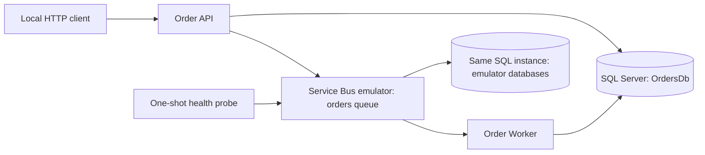

# Infrastructure guide

Local infrastructure runs through Docker Compose. SQL Server hosts both the Service Bus emulator's internal databases and the separate `OrdersDb` application database. API and Worker can run on the host or through the optional `apps` Compose profile.

## Topology



Compose creates a default bridge network. Containers reach dependencies using service DNS names, not `localhost`.

| Service | Image or build | Internal endpoint | Default host endpoint |
|---|---|---|---|
| `sql` | SQL Server `2022-latest`, `linux/amd64` | `sql:1433` | `127.0.0.1:1433` |
| `emulator` | Service Bus emulator `2.0.1` | `emulator:5672` | `127.0.0.1:5672` |
| Emulator management | Same emulator container | `emulator:5300` | `127.0.0.1:5300` |
| `emulator-health` | `curlimages/curl:8.15.0` | Probes emulator health | None |
| `api` (`apps` profile) | API Dockerfile | `api:8080` | `127.0.0.1:5080` |
| `worker` (`apps` profile) | Worker Dockerfile | `worker:8080` | `127.0.0.1:5081` |

All published ports bind to loopback. These ports describe Compose services; host-run application ports follow their launch settings or explicit URL configuration.

## Prerequisites

- Docker-compatible runtime and Docker Compose supporting profiles and dependency conditions.
- .NET 10 SDK for host-run applications and tests. Application container builds use their own SDK image.
- POSIX shell for repository scripts. Host `sqlcmd` installation is unnecessary: migrations run inside the SQL container.
- Sufficient Docker memory and disk for SQL Server and the emulator.

On Apple Silicon, SQL Server runs through x86-64 translation because its Linux image is not native ARM64. The emulator supports ARM64, but Microsoft does not officially support SQL Server on an ARM host through translation. Startup can be slower than on x86-64.

## Start the environment

Run commands from the repository root. Optionally copy `.env.example` to an ignored `.env` and edit local port or connection settings. Compose reads `.env`; host-run .NET processes and shell scripts do not automatically import its values into their environment.

### Infrastructure with host-run applications

```sh
./scripts/start-infra.sh
./scripts/migrate.sh
```

The first command starts SQL Server, the emulator, and the one-shot health probe. The second creates `OrdersDb`, runs numbered schema migrations, and provisions the local application login. Launch API and Worker separately using the commands in [README](../README.md#local-quick-start).

### Complete containerized stack

```sh
./scripts/start-all.sh
```

This starts infrastructure, applies migrations and local login bootstrap, builds application images, starts the `apps` profile, and waits for API and Worker liveness/readiness.

Starting the `apps` profile directly does not apply migrations. Both applications reject an incompatible schema at startup.

## Startup and health checks

1. SQL Server becomes healthy after a successful `SELECT 1` through its bundled `sqlcmd`.
2. Emulator starts after SQL health succeeds.
3. `emulator-health` polls `http://emulator:5300/health` and exits successfully once ready.
4. Application containers depend on healthy SQL and successful completion of the emulator probe.
5. `start-all.sh` checks application endpoints externally.

The separate probe is necessary because the emulator image is distroless and cannot execute a shell-based `curl` health check.

| Endpoint | Purpose |
|---|---|
| API `/alive` | Process liveness |
| API `/health` | SQL readiness; broker outages do not prevent durable Order acceptance |
| Worker `/alive` | Process liveness |
| Worker `/health` | SQL readiness and non-destructive Service Bus queue peek |
| Emulator `/health` on port 5300 | Emulator readiness |

Compose dependency conditions gate initial startup; they do not continuously restart dependents when a dependency becomes unhealthy. Application retry and readiness behavior handle subsequent outages.

## Configuration and connection endpoints

| Compose variable | Default / purpose |
|---|---|
| `ACCEPT_EULA` | `Y`; accepts SQL Server and emulator license terms |
| `MSSQL_SA_PASSWORD` | Local development SA password shared with the emulator |
| `SQL_PORT` | `1433` on the host |
| `SQL_WAIT_INTERVAL` | `5`, passed to emulator startup |
| `SERVICE_BUS_AMQP_PORT` | `5672` on the host |
| `SERVICE_BUS_MANAGEMENT_PORT` | `5300` on the host |
| `API_PORT` / `WORKER_PORT` | `5080` / `5081` on the host |
| `ORDERS_DB_COMPOSE_CONNECTION_STRING` | Application SQL connection using `sql:1433` |
| `SERVICE_BUS_COMPOSE_CONNECTION_STRING` | Emulator connection using `sb://emulator` |

Host-run SQL clients use `localhost,<SQL_PORT>`. Containerized applications use `sql,1433` regardless of the published host port.

Host-run Service Bus clients use:

```text
Endpoint=sb://localhost;SharedAccessKeyName=RootManageSharedAccessKey;SharedAccessKey=SAS_KEY_VALUE;UseDevelopmentEmulator=true;
```

For a remapped AMQP port, include it in the endpoint, such as `sb://localhost:15672`. Within Compose, use `sb://emulator`. The SAS value above is an emulator placeholder, not an Azure credential.

### Port conflicts

For an existing SQL Server bound to 1433:

```sh
SQL_PORT=15433 ./scripts/start-all.sh
```

Application containers still use internal port 1433. Host-run applications must separately override `ConnectionStrings__Orders` to use `localhost,15433`. Keep the same Compose port configuration for later commands, preferably in `.env`.

The full-test script uses `E2E_SQL_CONNECTION_STRING` and `E2E_SERVICE_BUS_CONNECTION_STRING` for its host-run child processes. Override these explicitly when remapping ports; changing Compose variables alone does not change test connection strings.

## SQL storage and schema lifecycle

- Named volume `sql-data` mounts at `/var/opt/mssql`. Compose prefixes the volume with its project name.
- Application tables live in `OrdersDb`, under `orders`; schema history lives under `infra`.
- Emulator manages its own databases in the same SQL instance. Do not edit them or point multiple emulator instances at that SQL instance.
- `database/migrations/` contains forward-only schema scripts with application locking and version recording.
- `database/local/app_login.sql` separately creates the fixed local-only application login and grants runtime access.
- `scripts/migrate.sh` is a local setup command: it executes both schema migrations and local credential bootstrap.
- Applications use EF Core at runtime but never apply migrations automatically.

Normal container stops and removals preserve the named SQL volume. Emulator messages and entities must still be treated as disposable across emulator restarts, even when SQL storage persists.

Changing the SA password environment variable does not constitute a password rotation for an existing database volume. Keep it consistent with the stored login or rotate the login explicitly.

## Messaging configuration

`infra/servicebus/Config.json` declares namespace `sbemulatorns` and one `orders` queue:

| Setting | Local value |
|---|---|
| Lock duration | 1 minute |
| Maximum delivery count | 5 |
| Default message TTL | 1 hour |
| Dead-letter expired messages | Enabled |
| Duplicate detection | Enabled; 5-minute window |
| Sessions | Disabled |
| Topics | None |

Queues represent consumer workflows, never individual HTTP endpoints. The built-in dead-letter subqueue handles expired and rejected messages.

Configuration is loaded at emulator startup. Restart the emulator after changing it, expecting broker state to reset. Local TTL and duplicate-detection limits differ from the proposed managed Azure settings; the emulator is not a production parity test.

## Application containers

Dockerfiles build with .NET SDK `10.0.100-noble`, use locked restores, and publish Release binaries. Final images use `10.0.11-noble-chiseled-extra` to retain globalization support.

API and Worker run as the non-root application user. Compose adds read-only root filesystems, temporary `/tmp` storage, dropped capabilities, and no-new-privileges.

The local API container uses Development with explicit anonymous access and emulator transport. The Worker container uses Production environment settings with explicit emulator/SQL overrides. Neither configuration represents a production cloud deployment.

## Operations and troubleshooting

```sh
# Inspect infrastructure and optional applications
docker compose --profile apps ps --all
docker compose logs --tail 100 sql emulator emulator-health
docker compose --profile apps logs --tail 100 api worker

# Validate configuration without starting containers
docker compose config --quiet
docker compose --profile apps config --quiet

# Stop all services while preserving SQL data
docker compose --profile apps down
```

| Symptom | Checks |
|---|---|
| Port already allocated | Change the corresponding host port and host-client connection settings |
| SQL never becomes healthy | Inspect SQL logs, Docker resources, x86 translation, EULA, and password configuration |
| Emulator probe fails | Inspect SQL health, emulator logs, mounted configuration, and shared SA password |
| Application rejects schema | Run migration script against the intended database and verify connection settings |
| API healthy but Orders remain pending | Inspect publisher logs and emulator connectivity; SQL-only readiness is intentional |
| Worker unhealthy | Check SQL login/schema and queue endpoint, then inspect Worker logs |

**Destructive reset:**

```sh
./scripts/reset.sh --yes
```

This removes local SQL storage, recreates infrastructure, and reapplies schema/local bootstrap. Orders and processing history are permanently deleted. Stop optional applications first with `docker compose --profile apps down`.

## Verification

```sh
# Fast tests; Docker scenario skipped by default
dotnet test --solution AzureBusService.sln

# Infrastructure, migrations, and real API-to-Worker queue flow
./scripts/test-all.sh

# Build application images
docker compose --profile apps build api worker
```

The full-test script leaves infrastructure running. Use Compose shutdown afterward when finished. Test child API/Worker processes clean themselves up.

## Managed Azure boundary

Kubernetes deployment and cloud infrastructure provisioning remain outside this repository's current scope. Managed Azure Service Bus support is an application configuration path, not a deployment definition.

- Configure `ServiceBus__Mode=Azure`, the fully qualified namespace, and queue name. Applications authenticate through `DefaultAzureCredential`.
- Provision queue properties, Azure identities, role assignments, networking, and production SQL separately.
- Assign API publishing and Worker receiving permissions separately. Configure Workload Identity for future Kubernetes hosting.
- Apply production schema migrations without running local login bootstrap. Provision least-privilege production database principals separately, including schema-version read access.
- Enable API JWT validation and configure authority/audience; anonymous mode is rejected outside Development with emulator transport.
- Supply an OTLP endpoint to export telemetry; no observability backend is included locally.

See [README](../README.md) for application configuration and [foundation specification](azure-service-bus-order-processing-foundation-spec.md) for the agreed scope.
