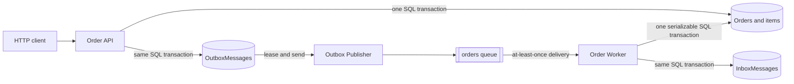
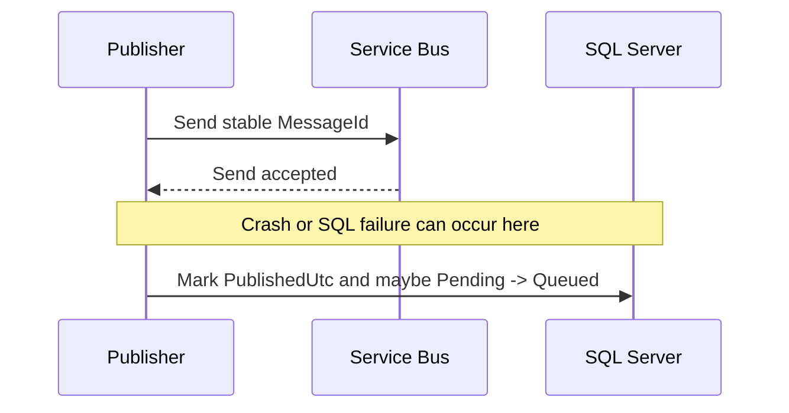
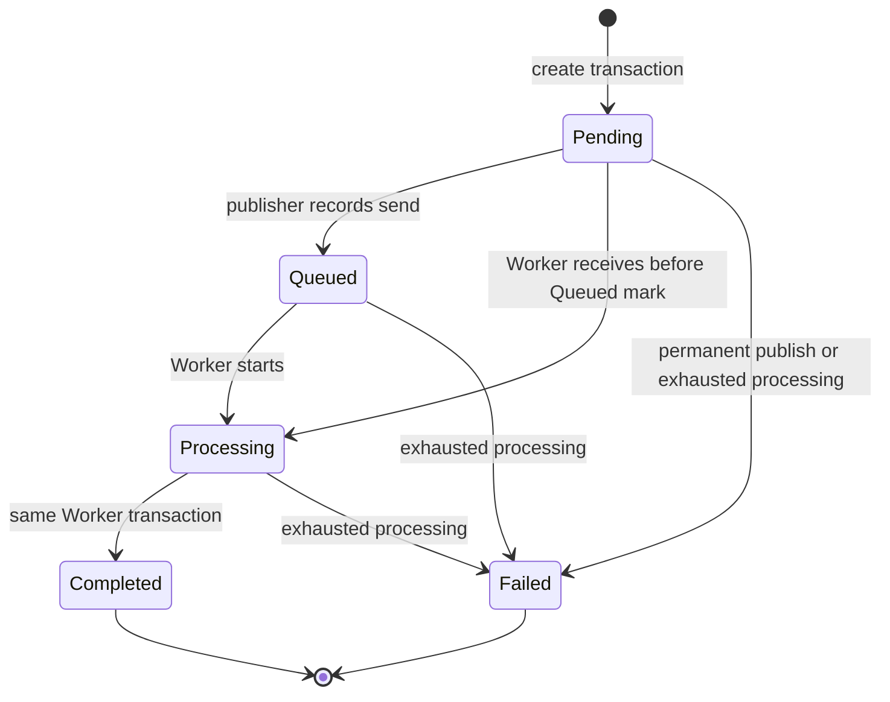

# Messaging reliability

This document describes the messaging behavior implemented by the current API,
Worker, Contracts, Persistence, SQL schema, and local Service Bus configuration.
It is not a target-state design. For the client-facing HTTP surface, use the
[HTTP API contract](api-contract.md). For startup, ports, credentials, and
infrastructure troubleshooting, use the
[infrastructure guide](infrastructure.md).

## Purpose and reliability model

The API accepts an Order into SQL before trying to send it to Service Bus. An
API-hosted Outbox Publisher later transfers the stored message to the `orders`
queue. The Worker validates the message, verifies its SQL provenance, and
atomically records both the Order result and an Inbox receipt before completing
the broker message.



### Guarantees

- `202 Accepted` is returned only after the Order, all Order Items, and one
  Outbox Message commit in one SQL transaction.
- The HTTP request path does not send to Service Bus. A broker outage does not
  undo already accepted work.
- An unpublished, unquarantined Outbox row remains eligible for later delivery.
  Transient publication failures have no application-level attempt limit.
- The same message ID is used in the Outbox row, JSON body, Service Bus
  `MessageId`, and Inbox primary key.
- A normal successful Worker path requires a matching, unquarantined persisted
  Outbox row.
- Successful Order processing and its Inbox receipt commit atomically before
  broker completion.
- A redelivery whose Inbox receipt is still retained completes as a no-op.
- Direct validation and provenance rejections are dead-lettered without changing
  an Order.
- `Completed` and `Failed` are terminal in application code.

### Non-guarantees

- No distributed transaction spans SQL Server and Service Bus.
- Publication, delivery, and settlement are not exactly once. Duplicate sends
  and deliveries are expected recovery behavior.
- There is no global or per-Order ordering guarantee. Sessions are not used.
- Eventual publication or completion is not guaranteed when dependencies remain
  unavailable, a message expires, a permanent send error is quarantined, or an
  operator does not resolve a dead-letter.
- Inbox deduplication and Outbox provenance are retention-bounded.
- `Completed` represents only the implemented SQL state transition. The Worker
  does not call payment, inventory, fulfillment, or another external system.
- No automatic dead-letter inspection, correction, or replay exists.

## Queue workflow ownership

One queue represents one consumer workflow. The `orders` queue belongs to the
`AzureBusService.Worker` Order-processing workflow. Replicas of that Worker may
compete for messages because they implement the same behavior.

Do not create a queue per HTTP endpoint and do not attach an unrelated competing
consumer to `orders`. A separate independent workflow requires its own delivery
entity; none is implemented in this repository.

## `OrderCreatedV1` contract

Contract version and HTTP API version are independent. The only implemented
message contract is:

```text
ContractName = OrderCreatedV1
SchemaVersion = 1
```

### JSON body

The producer stores and sends JSON serialized from this shape:

```json
{
  "messageId": "01993d34-91c2-7a08-a3d5-b168a4d32f1c",
  "orderId": "01993d34-91c2-7a08-a3d5-b168a4d32f1d",
  "correlationId": "01993d34-91c2-7a08-a3d5-b168a4d32f1e",
  "createdUtc": "2026-09-16T14:25:31.4821930+00:00",
  "customerId": "10000000-0000-0000-0000-000000000001",
  "currency": "USD",
  "total": 25.00,
  "items": [
    {
      "productId": "20000000-0000-0000-0000-000000000001",
      "quantity": 2,
      "unitPrice": 12.50
    }
  ]
}
```

| Field | Producer value and Worker requirement |
|---|---|
| `messageId` | Producer-generated UUID v7. Worker requires a non-empty UUID equal to the broker `MessageId`. |
| `orderId` | Producer-generated UUID v7. Worker requires a non-empty UUID equal to application property `OrderId`. |
| `correlationId` | Producer-generated UUID v7. Worker requires a non-empty UUID equal to application property `CorrelationId`. |
| `createdUtc` | Order creation time. Worker requires a non-default `DateTimeOffset` with UTC offset zero. |
| `customerId` | Accepted non-empty customer UUID. |
| `currency` | Exactly three ASCII uppercase letters `A` through `Z`. Registry membership is not checked. |
| `total` | Service-computed decimal total. It must equal the sum of item quantity times unit price, have at most four fractional digits, and not exceed `999999999999999.9999`. |
| `items` | 1 through 100 items. Product IDs must be non-empty and unique. |
| `items[].productId` | Non-empty product UUID. |
| `items[].quantity` | Integer from 1 through 1000. |
| `items[].unitPrice` | Positive decimal with at most four fractional digits and no greater than `999999999999999.9999`. |

The producer uses the same timestamp for Order creation, Outbox creation, and
the contract `createdUtc`. It preserves accepted item order in the message.

### Service Bus envelope and application properties

Property names and string values below are case-sensitive.

| Location | Name | Producer value | Worker use |
|---|---|---|---|
| Broker envelope | `MessageId` | Body `messageId` in canonical UUID `D` format | Required, parsed as a non-empty UUID, and compared with the body. |
| Broker envelope | `CorrelationId` | Body `correlationId` in canonical UUID `D` format | Set by the producer, but the current Worker does not read or validate this envelope field. |
| Broker envelope | `Subject` | `OrderCreatedV1` | Required and compared ordinally with the contract name. |
| Broker envelope | `ContentType` | `application/json` | Set by the producer, but not validated by the Worker. |
| Application property | `ContractName` | String `OrderCreatedV1` | Required and must equal `Subject`. |
| Application property | `SchemaVersion` | Integer `1` | Required. Worker accepts an integral `byte`, `short`, `int`, or in-range `long`, then requires value 1. |
| Application property | `OrderId` | Body `orderId` in canonical UUID `D` format | Required. Worker accepts a non-empty `Guid` value or parseable string and compares it with the body. |
| Application property | `CorrelationId` | Body `correlationId` in canonical UUID `D` format | Required. Worker accepts a non-empty `Guid` value or parseable string and compares it with the body. |
| Application property | `traceparent` | Current producer activity ID, when an activity exists | Optional W3C parent context for the Worker span. |
| Application property | `tracestate` | Current producer trace state, when present | Optional W3C trace state for the Worker span. |

The producer does not set a per-message TTL, session ID, partition key, or
scheduled enqueue time. Queue defaults therefore control expiration. Business
data is authoritative in the body; envelope duplication exists for routing,
validation, correlation, and diagnostics.

## Queue settings

### Checked-in local emulator settings

`infra/servicebus/Config.json` creates namespace `sbemulatorns` and one queue:

| Setting | Exact local value |
|---|---|
| Queue | `orders` |
| Default message TTL | 1 hour (`PT1H`) |
| Dead-letter on expiration | Enabled |
| Duplicate detection | Enabled |
| Duplicate-detection history | 5 minutes (`PT5M`) |
| Lock duration | 1 minute (`PT1M`) |
| Maximum delivery count | 5 |
| Sessions | Disabled |
| Forwarding | No destination configured |
| Topics | None |

### Managed Azure guidance already recorded by this repository

The repository does not provision an Azure namespace or queue. Existing design
guidance records a 7-day production default TTL and a 10-minute production
duplicate-detection window. These are deployment settings, not behavior applied
by either binary. Queue creation, dead-letter-on-expiration, lock duration, and
other managed settings remain an external responsibility.

The Worker's exception threshold is hard-coded at delivery count 5. A managed
queue must permit a fifth delivery; setting `MaxDeliveryCount` to 5 aligns with
the local queue and application behavior. A lower value can let the broker move
a message to the DLQ before the Worker records retry exhaustion. A higher value
does not extend application retries because the Worker dead-letters caught
exceptions at delivery count 5 or greater.

## Producer transaction and Outbox lifecycle

### Durable creation

For a new owner and idempotency key, the API:

1. Generates UUID v7 Order, message, correlation, and Order Item IDs.
2. Builds the `Pending` Order and its items.
3. Serializes `OrderCreatedV1` into `OutboxMessages.PayloadJson`.
4. Begins one SQL transaction.
5. Inserts the Order, items, and Outbox row.
6. Commits, then returns `202 Accepted`.

The initial Outbox row has `CreatedUtc` and `NextAttemptUtc` set to the creation
time, `AttemptCount = 0`, and null publication, lease, failure, and quarantine
fields. An equivalent HTTP idempotency replay does not add another Outbox row.

### Persisted Outbox states

The schema does not store a state enum. State is derived from columns:

| Derived state | Defining columns | Publisher behavior |
|---|---|---|
| Due/unclaimed | `PublishedUtc IS NULL`, `QuarantinedUtc IS NULL`, `NextAttemptUtc <= now`, and lease absent or expired | Eligible to claim. |
| Leased | Same non-terminal columns plus this publisher's `LeaseOwner` and a future `LeaseExpiresUtc` | Sent by the claiming publisher. No lease renewal exists. |
| Retry scheduled | Unpublished and unquarantined, lease cleared, failure fields populated, and `NextAttemptUtc` in the future | Becomes due after the scheduled time. |
| Published | `PublishedUtc` is set and `QuarantinedUtc` is null | Never claimed again; eligible for later cleanup. |
| Quarantined | `QuarantinedUtc` is set and `PublishedUtc` is null | Never retried or cleaned automatically. Requires operator review. |

The SQL constraint prevents a row from being both published and quarantined and
requires lease owner and expiry to be both null or both non-null.

On recorded success, one SQL transaction sets `PublishedUtc` and
`LastAttemptUtc`, increments `AttemptCount`, clears lease and prior failure
fields, and changes the Order from `Pending` to `Queued` if it is still
eligible. On a recorded permanent failure, one SQL transaction increments the
attempt, records sanitized failure data, clears the lease, sets
`QuarantinedUtc`, and changes an active Order to `Failed` with:

```text
FailureCode    = publish_failed
FailureMessage = Order publication failed.
```

Terminal Orders are not moved backward by either transaction.

### SQL lease algorithm and multiple API replicas

Every API replica runs one Outbox Publisher with a process-unique lease owner of
`<machine-name>:<random-guid>`.

One atomic SQL `UPDATE` claims at most 100 rows from a CTE that:

- Uses `UPDLOCK`, `READPAST`, and `ROWLOCK`.
- Selects unpublished and unquarantined rows whose retry time is due.
- Accepts rows with no lease or a lease expired according to
  `SYSUTCDATETIME()`.
- Orders candidates by `CreatedUtc`.
- Sets a one-minute lease and returns the persisted message data through
  `OUTPUT`.

`UPDLOCK` prevents simultaneous claims of the same unlocked row, `READPAST`
lets another publisher skip locked work, and expiry makes work recoverable after
a publisher crash. Each publisher sends its claimed rows sequentially. If the
batch is empty, it waits one second. After a transient publication failure it
stops that batch; remaining rows keep their leases until expiry. A permanent
failure does not stop processing the rest of the batch.

Leases are not renewed. A send, SDK retry sequence, or long sequential batch can
outlive one minute. Another replica may then reclaim a row while the original
publisher is still working. The lease owner predicate prevents the old replica
from normally updating a lease now owned by another publisher, but it cannot
prevent duplicate broker sends. Stable IDs and consumer idempotency provide the
safety boundary.

### Sender retries, classification, and quarantine

Publication has three recovery layers:

1. The Service Bus SDK uses exponential retry with `MaxRetries = 5`,
   `MaxDelay = 10 seconds`, and `TryTimeout = 60 seconds` for a send operation.
2. After an exception escapes the send/publication block, the Outbox records a
   durable retry time or quarantine state.
3. SQL writes used to record publication or failure run through EF Core's SQL
   execution strategy, configured for up to 5 retries with a maximum 30-second
   delay.

The application classifies exceptions as follows:

| Exception | Classification | Stored code and message | Result |
|---|---|---|---|
| `JsonException` or `NotSupportedException` | Permanent invalid payload | `invalid_payload`; `Outbox payload is invalid.` | Quarantine and fail an active Order. |
| Non-transient `ServiceBusException` | Permanent broker rejection | `service_bus_permanent`; `Service Bus rejected the message permanently.` | Quarantine and fail an active Order. |
| `ArgumentException` or `InvalidOperationException` | Permanent configuration error | `service_bus_configuration`; `Service Bus configuration is invalid.` | Quarantine and fail an active Order. |
| Any other exception | Transient | `service_bus_transient`; `Service Bus is temporarily unavailable.` | Clear lease and schedule another attempt. |

Stored messages are also rejected as invalid payload before send unless body
message ID, body Order ID, non-empty correlation ID, contract name, and schema
version agree with the claimed row.

For recorded attempt number `n`, transient Outbox delay is:

```text
base = min(300, 2 ^ min(n, 9)) seconds
delay = min(300, base * (0.5 + jitter)) seconds
jitter is Random.Shared.NextDouble(), from 0 inclusive to 1 exclusive
```

The first recorded failure therefore waits from 1 second inclusive to 3 seconds
exclusive. Delay is capped at 300 seconds. There is no transient-attempt cap.
The main publisher loop also waits one second after an unhandled iteration
failure.

### Send/mark ambiguity and duplicate handling

Broker send and SQL publication marking are separate operations:



If Service Bus accepted the message but the SQL mark is lost or uncertain, the
Outbox row remains unpublished and can be sent again. Broker duplicate detection
may suppress a repeat inside its history window. Outside that window, or when
the first outcome was ambiguous, the Worker Inbox is the authoritative
deduplication mechanism.

Consequences visible in SQL and status:

- `Pending` means publication has not been recorded; it does not prove that no
  send occurred.
- A Worker can process a message before the publisher records `Queued`.
- An Order can be `Completed` while its Outbox row still appears unpublished.
- `Queued` means the publisher both sent and recorded publication, not that the
  Worker has not already started.

## Consumer processing

### Processor settings

Each Worker process creates one non-session Service Bus processor with:

| Setting | Current value |
|---|---:|
| `AutoCompleteMessages` | `false` |
| `MaxConcurrentCalls` | 16 by default; configurable from 1 through 256 |
| `PrefetchCount` | 32 |
| `MaxAutoLockRenewalDuration` | 5 minutes |
| Host shutdown timeout | 30 seconds |

The Service Bus client uses the same exponential SDK retry settings as the
producer: 5 retries, 10-second maximum delay, and 60-second try timeout.

### Validation sequence

Validation occurs before successful business processing in this exact order:

1. Parse application property `OrderId` as a possible trusted metadata value.
2. Require a non-empty body no larger than 256 KiB (`262144` bytes).
3. Require `Subject` and application property `ContractName` to both equal
   `OrderCreatedV1` and each other using ordinal comparison.
4. Parse application property `SchemaVersion` as a supported integral value and
   require version 1.
5. Parse broker `MessageId` as a non-empty UUID.
6. Require application property `OrderId` to be a non-empty UUID.
7. Require application property `CorrelationId` to be a non-empty UUID.
8. Deserialize the body as `OrderCreatedV1`.
9. Validate all body identities, UTC timestamp, currency, item count, unique
   products, quantity, decimal range and scale, arithmetic overflow, and exact
   computed total.
10. Require body message, Order, and correlation IDs to equal their validated
    envelope or application-property values.

Invalid messages receive a sanitized reason and diagnostic; raw body content
and untrusted metadata values are not copied into those strings.

| Validation reason | Condition category | Diagnostic |
|---|---|---|
| `InvalidMessageSize` | Empty body or body over 256 KiB | `Message body size is invalid.` |
| `ContractMismatch` | Subject or contract property missing/wrong/disagreeing | `Message contract metadata is invalid.` |
| `UnknownSchemaVersion` | Schema property unsupported or not version 1 | `Message schema version is not supported.` |
| `MetadataMismatch` | Missing, empty, malformed, or body-disagreeing identity metadata | `Message identity metadata is invalid.` or `Message metadata does not match its body.` |
| `MalformedMessage` | JSON/type failure or failed body business constraints | `Message body is malformed.` |

Unknown JSON properties are ignored by the current serializer. Provenance
comparison is against reserialization of the typed body, not the raw wire bytes.

### Persisted Outbox provenance

After validation and after checking for an existing Inbox receipt, the Worker
loads `OutboxMessages` by body `messageId`. Successful processing requires:

- The Outbox row exists under that message ID.
- Its `OrderId` equals the body `orderId`.
- Its contract name is exactly `OrderCreatedV1`.
- Its schema version is exactly 1.
- `QuarantinedUtc` is null.
- Its stored `PayloadJson` is ordinally equal to JSON serialization of the
  validated typed message.

`PublishedUtc` is deliberately not required because delivery can beat the SQL
publication mark. Failure returns `MessageProvenanceFailed` and is dead-lettered
without changing an Order.

The check uses canonical typed reserialization. Whitespace and incoming property
order are not compared directly, and ignored unknown properties do not survive
reserialization. All represented contract values still have to reproduce the
stored payload exactly.

### Inbox transaction and idempotency

Valid processing runs through the SQL execution strategy inside a serializable
transaction:

1. Check `InboxMessages` by message ID.
2. If found, commit the read transaction and return a duplicate no-op.
3. Verify persisted Outbox provenance.
4. Load the Order.
5. Reject a missing, `Failed`, or `Completed` Order.
6. Move an active `Pending`, `Queued`, or `Processing` Order to `Processing` and
   save inside the transaction.
7. Move it to `Completed`, clear failure fields, and insert the Inbox receipt.
8. Commit the transaction.
9. Complete the Service Bus message.

`InboxMessages.MessageId` is the primary key. The receipt stores contract name,
schema version, and the same current UTC value in `ReceivedUtc` and
`ProcessedUtc`. It records when this handler transaction processed the message,
not the broker's original enqueue or receive time.

`Processing` and `Completed` are saved separately but inside one transaction,
so other transactions normally see neither intermediate write until commit. A
crash before commit rolls both writes and the Inbox insert back. A crash after
commit leaves the Inbox receipt available for redelivery.

### Manual settlement decisions

| Handler outcome | Settlement and diagnostic | Order mutation |
|---|---|---|
| Successful transaction | Complete | Active Order becomes `Completed`. |
| Existing Inbox message ID | Complete | None; duplicate no-op. |
| Validation failure | Dead-letter immediately with the reason and diagnostic in the validation table | None. |
| Provenance mismatch | Dead-letter as `MessageProvenanceFailed`; `Message does not match a persisted outbox record.` | None. |
| Missing Order | Dead-letter as `OrderNotFound`; `Order does not exist.` | None. |
| Order already `Failed` | Dead-letter as `OrderFailed`; `Order is already in a failed state.` | None. |
| Order already `Completed` without a matching retained Inbox receipt | Dead-letter as `InvalidOrderState`; `Order cannot accept this message.` | None. |
| Caught exception before delivery 5 | Abandon | SQL effects depend on whether a prior transaction committed; Inbox handles redelivery after commit. |
| Caught exception at delivery 5 or greater | Validate again, mark a referenced active Order failed when possible, then dead-letter as `MaxDeliveryCountExceeded`; `Message processing failed after five deliveries.` | May change `Pending`, `Queued`, or `Processing` to `Failed`. |
| Handler cancellation requested | Rethrow cancellation | No explicit settlement by application code. |

Completion and the normal-result dead-letter call are inside the handler's main
`try` block, so their failures enter the delivery-count exception path.
Abandonment and the delivery-count-five dead-letter call execute from that
`catch` block; a failure from either escapes the callback rather than re-entering
the same catch. Processor-level errors outside a message callback are logged;
the application has no message to settle in that callback.

### Delivery-count-five behavior and current limitation

On any caught handler exception where broker `DeliveryCount >= 5`, the Worker:

1. Logs the error type and delivery count.
2. Re-runs structural, metadata, and business validation.
3. If that validation returns a message, passes its body Order ID to a
   serializable `MarkFailedAsync` transaction.
4. Changes only an active Order to `Failed`, using code
   `MaxDeliveryCountExceeded` and message
   `Message processing failed after five deliveries.`
5. Dead-letters the broker message with the same reason and diagnostic.

Current limitation: this exception path does not repeat persisted Outbox
provenance verification. Its Order ID is protected by envelope/body validation,
but not by an Outbox match. Normal direct validation rejection still does not
change an Order, and a normal provenance rejection returns a dead-letter result
without changing an Order. The gap applies when an exception reaches the
delivery-count-five catch path, including a settlement exception.

If validation fails in that catch path, no Order is marked failed, but the
message is still dead-lettered as `MaxDeliveryCountExceeded`. If the referenced
Order is absent or already terminal, `MarkFailedAsync` makes no change. If the
failure-marking transaction itself throws, the final dead-letter call is not
reached and the exception escapes the callback. If failure status commits but
the final dead-letter call fails, the message remains unsettled; a later delivery
normally sees the terminal Order and returns `OrderFailed`.

## Order status transitions and races



| Status | Messaging meaning |
|---|---|
| `Pending` | Durable Order and Outbox intent exist. Broker send is not yet recorded. |
| `Queued` | Broker send and the publisher's SQL publication mark both succeeded. |
| `Processing` | Worker intermediate state inside the successful processing transaction. |
| `Completed` | Worker committed the Order result and Inbox receipt. |
| `Failed` | A permanent publish failure was quarantined, or caught processing/settlement exceptions exhausted the Worker's retry threshold for an active Order. |

The Worker accepts `Pending`, `Queued`, and `Processing` because queue delivery
can race the publication mark. The publisher only changes `Pending` to `Queued`;
it does not regress `Processing`, `Completed`, or `Failed`. Worker failure logic
changes only active states. SQL `rowversion`, transaction locks, execution
retries, and these transition guards resolve or surface concurrent updates.

Clients can skip `Queued` and `Processing`. SQL Order status, not queue depth,
message presence, Outbox state, or delivery count, is the client-visible
authority. There is no status history.

## Crash and failure matrix

| Failure point | Durable result | Recovery or externally visible effect |
|---|---|---|
| API fails before create transaction commit | No accepted Order or Outbox row | Client may submit again. |
| API commits but response is lost | Order, items, and Outbox row exist | Retry with the same owner/key and equivalent payload returns the original Order. |
| Publisher crashes after claim but before send | Row remains leased for at most the remaining one-minute lease | Same or another API replica can reclaim it after expiry. |
| Send fails definitively with a transient exception | Failure and next attempt are recorded when SQL is available | Publisher retries after capped exponential delay; current batch stops. |
| Send fails permanently | Outbox is quarantined and active Order fails in one SQL transaction | No automatic retry or quarantine cleanup. |
| Broker accepts send, then publisher crashes before SQL mark | Message may be available while Outbox remains unpublished | Row is sent again after lease expiry; broker detection and Inbox reduce duplicate effects. |
| Broker accepts send, then publication SQL outcome is ambiguous | Publication mark may or may not have committed | EF and Outbox retries can repeat work; status and row predicates prevent terminal status regression. |
| Worker rejects size, contract, schema, metadata, body, or provenance | No Order or Inbox mutation | Message is dead-lettered immediately. |
| Worker fails before its SQL commit | Worker transaction rolls back | Delivery 1 through 4 is abandoned; lock expiry/redelivery is also possible. |
| Worker commits, then crashes before complete | `Completed` Order and Inbox receipt survive | Redelivery finds Inbox and completes as a no-op. |
| Complete call is ambiguous or fails | SQL may already be committed | Handler abandons before delivery 5; redelivery deduplicates. At delivery 5 the exception path dead-letters, but a `Completed` Order is not failed. |
| Processing exception reaches delivery 5 | Active structurally referenced Order can be marked `Failed` | Message is dead-lettered as `MaxDeliveryCountExceeded`; provenance is not rechecked on this path. |
| Delivery-5 failure status commits, then dead-letter settlement fails | Order remains `Failed`; message is not known to be settled | A later delivery normally dead-letters as `OrderFailed`. |
| Lock cannot be renewed beyond 5 minutes | Broker can make the message available again and settlement can fail | Concurrent/redelivered handling relies on serializable SQL and Inbox deduplication. |
| Message expires before Worker handling | With local configuration, broker moves it to DLQ | Application does not update the Order; status can remain active. |
| Published Outbox provenance is cleaned before a late delivery/replay | Outbox lookup fails | Worker dead-letters as `MessageProvenanceFailed`. |
| Inbox receipt is cleaned before a very late duplicate | Durable duplicate marker is gone | Provenance and Order state are re-evaluated; a `Completed` Order is dead-lettered as `InvalidOrderState`, not processed again. |

## TTL, duplicate detection, and locks

- The producer relies on queue default TTL. Local TTL is one hour and expiration
  is dead-lettered. Expiration happens in the broker, so the Worker cannot mark
  the Order based on a message it never receives.
- Broker duplicate detection uses stable `MessageId` and a local five-minute
  history window. Existing managed-Azure guidance says ten minutes. It only
  suppresses sends within the configured window and never replaces the Inbox.
- Outbox retries have no maximum age. A retry after the duplicate-detection
  window can create another delivery of the same message ID.
- Local message locks last one minute. The processor auto-renews while handling,
  but only for a maximum of five minutes. SQL and SDK retry delays can consume
  that budget.
- No application-level processing timeout stops work before lock-renewal expiry.
  If a lock is lost, settlement can fail and delivery can overlap another
  Worker callback.
- Sessions are disabled, so lock ownership does not imply Order ordering.

## Retention and cleanup

| Data | Current retention behavior | Reliability consequence |
|---|---|---|
| Published Outbox rows | Deleted when `PublishedUtc` is older than 7 days. Cleanup runs immediately at API startup and then hourly, in batches of at most 500. | Provenance is unavailable for later delivery or replay. |
| Unpublished retrying Outbox rows | No age-based deletion. | Transient publication retries can continue indefinitely. |
| Quarantined Outbox rows | No automatic deletion or retry. | Evidence remains for manual diagnosis. |
| Inbox receipts | 30 days by default, configured by positive `Inbox:RetentionDays`. Cleanup runs immediately at Worker startup and then hourly, in batches of at most 500. | Durable duplicate completion is bounded by receipt retention. |
| Orders and Order Items | No application cleanup. | Idempotency keys and terminal status remain while rows remain. |
| DLQ messages | Controlled by broker/service operations; no repository cleanup process. | Operators must inspect and resolve them manually. |

Every API or Worker replica runs its corresponding cleanup service. Concurrent
delete attempts are allowed; batches select IDs and then issue set-based deletes.

## Trace propagation and correlation

The Outbox Publisher starts an `outbox.publish` producer activity. When an
activity is created, its W3C ID is written to `traceparent`; `tracestate` is also
written when present. The Worker parses those properties as remote W3C context
and starts a `process order message` consumer activity. Invalid or missing trace
context starts an unparented Worker activity and does not invalidate the
business message.

The Outbox does not persist the original HTTP activity context. Publication is
asynchronous, so its producer activity normally starts a new trace rather than
durably continuing the POST trace. `correlationId`, Order ID, and message ID are
the stable application correlations across SQL and transport. Baggage is not
propagated by application code.

## Metrics and logs

Both processes emit structured JSON console logs. OTLP export for traces,
metrics, and logs is enabled only when `OTEL_EXPORTER_OTLP_ENDPOINT` is set.
There is no bundled collector, dashboard, alerting policy, or Prometheus
endpoint.

### Messaging metrics

| Meter | Instrument | Meaning |
|---|---|---|
| `AzureBusService.Api` | `outbox.published` counter | Send succeeded and `MarkPublishedAsync` returned. A rare lost-lease no-op mark still reaches this increment. |
| `AzureBusService.Api` | `outbox.publish_failures` counter | Publish block failed; tagged with `failure.code`. |
| `AzureBusService.Api` | `outbox.backlog` observable gauge | Count of all unpublished, unquarantined Outbox rows, including leased and future-retry rows. Updated when a claim query runs. |
| `AzureBusService.Api` | `orders.accepted` counter | Accepted HTTP outcomes, including equivalent idempotent replays. |
| `AzureBusService.Api` | `orders.conflicts` counter | Conflicting idempotency-key reuse. |
| `AzureBusService.Worker` | `orders.messages.completed` counter | Broker completion call succeeded. Includes duplicate no-ops. |
| `AzureBusService.Worker` | `orders.messages.duplicates` counter | Completed message had an existing Inbox receipt. |
| `AzureBusService.Worker` | `orders.messages.abandoned` counter | Explicit abandonment succeeded. |
| `AzureBusService.Worker` | `orders.messages.dead_lettered` counter | Explicit dead-letter call succeeded. |
| `AzureBusService.Worker` | `orders.messages.processing.duration` histogram, milliseconds | Entire callback duration through processing and attempted settlement. |

Publisher logs identify iteration failures, successful message/Order IDs, and
failure code plus exception. Worker logs sanitized message IDs, dead-letter
reasons, delivery count and exception type, and processor error source/type.
Cleanup services log deleted row counts and failures. Request bodies, raw
idempotency keys, credentials, and raw invalid metadata are not intentionally
included in these custom logs.

## DLQ operator workflow and replay constraints

DLQ handling is manual. This repository intentionally supplies no inspection or
replay command.

1. Inspect the `orders` dead-letter subqueue with approved Service Bus tooling
   or operator-written SDK code.
2. Record the broker dead-letter reason/description, message ID, Order ID,
   delivery count, enqueue/expiration data, and relevant application logs and
   traces. Do not copy sensitive bodies into tickets or logs without an approved
   data-handling path.
3. Determine whether the source is validation, provenance, missing/terminal
   Order state, retry exhaustion, TTL expiration, or infrastructure policy.
4. Inspect the matching Order, Outbox row, and Inbox receipt in the application
   database using read-only operational access.
5. Correct the root cause before considering replay. Replaying an unchanged
   malformed message produces the same dead-letter result.
6. Approve replay explicitly and monitor settlement, Order state, Inbox state,
   and repeat DLQ activity.

Replay safety constraints:

- Preserve the original body, message ID, `Subject`, and required application
  properties. Changing identity or payload breaks provenance or creates a new
  logical message.
- A matching, unquarantined Outbox row must still exist. Published Outbox cleanup
  after seven days can make an old message unreplayable through the normal
  Worker path.
- A retained Inbox receipt makes replay a completed no-op. This is safe but does
  not repeat processing.
- A `Failed` Order is terminal. Replaying its message dead-letters as
  `OrderFailed`; there is no supported reopen transition.
- A `Completed` Order without its Inbox receipt dead-letters as
  `InvalidOrderState`; it does not process again.
- Broker duplicate detection can suppress a resend with the original message ID
  while that ID remains inside the history window. Account for the configured
  window when verifying whether a replay was enqueued.
- Do not treat replay as a way to repair TTL-expired active Orders or terminal
  failures without first understanding the SQL state. No supported automated
  reconciliation exists.
- Do not move a DLQ message back merely to clear queue depth. Preserve evidence
  until diagnosis and approval are complete.

## Scaling and backpressure

### API and publishers

- Every API replica hosts a publisher and cleanup service.
- A publisher claims at most 100 rows and sends them sequentially.
- SQL leases distribute due rows, but expired leases and send/mark ambiguity can
  produce duplicates under load or failure.
- A transient failure stops the current batch, allowing its remaining leases to
  expire instead of immediately hammering the broker.
- `NextAttemptUtc` backoff limits retries per failed row. A one-second idle or
  iteration-failure delay limits empty/error loops.
- The backlog gauge is available for external monitoring, but the repository
  contains no autoscaler or admission control based on it.

### Workers

- Worker replicas are competing consumers of the same workflow queue.
- Concurrency and prefetch are per process. With `N` default-configured replicas,
  configured callback concurrency is up to `16 * N` and prefetched messages are
  up to `32 * N`, subject to SDK and broker behavior.
- Increasing concurrency also increases SQL transaction and connection pressure.
  SQL Server is the shared consistency and throughput boundary.
- Serializable transactions and the Inbox primary key protect the implemented
  SQL effect; they do not create message ordering.
- Worker readiness checks SQL and performs a non-destructive queue peek, but an
  unhealthy readiness result does not itself pause the processor.
- Graceful shutdown asks the processor to stop and has a 30-second host timeout.
  Unsettled locks can expire and cause redelivery.

## Test strategy and current coverage

Fast tests run with:

```sh
dotnet test --solution AzureBusService.sln
```

Current source-level coverage includes:

- API request boundaries, totals, overflow, normalized fingerprints,
  idempotency keys, status transitions, and ETags.
- Producer envelope construction, property casing, trace properties, body/claim
  identity rejection, and representative Outbox jitter boundaries.
- Worker contract, schema, metadata, correlation, body business validation,
  totals, state transitions, and persisted provenance matching.

The opt-in end-to-end test starts real API and Worker processes against SQL
Server and the Service Bus emulator, creates one Order over HTTP, and polls it to
`Completed`. `scripts/test-all.sh` starts infrastructure, applies migrations,
sets `RUN_END_TO_END_TESTS=true` by default, and runs the solution.

The current suite does not explicitly fault-inject every crash-matrix case. It
has no dedicated automated scenario for competing publisher leases, send/mark
ambiguity, fifth-delivery failure, TTL expiration, DLQ replay, lock-renewal
expiry, cleanup races, or a duplicate arriving after retention. The emulator
happy path therefore complements but does not prove every managed-Azure
reliability property.

## Emulator limitations

The Microsoft Azure Service Bus Emulator 2.0.1 is a local development aid, not a
production parity environment. It does not validate Microsoft Entra
authentication, managed identity, RBAC, Azure networking, availability zones,
service SLA, quotas, autoscaling, portal operations, metrics, geo-disaster
recovery, or all managed Service Bus behavior.

Treat emulator entities and messages as disposable across emulator or container
restart. This differs from application `OrdersDb`, which uses the named SQL
volume. Emulator tests run sequentially because the emulator has limited local
connections and entities. Passing local tests does not establish production
throughput, failover, or operational behavior.

## Configuration compatibility requirements

Deployments and contract changes must preserve these compatibility points:

1. API and Worker must address the same Service Bus namespace and queue name.
   The provisioned queue must exist; neither application creates it.
2. `ServiceBus:Mode` must explicitly be `Emulator` or `Azure`. Emulator mode
   requires a connection string. Azure mode requires a fully qualified namespace
   and uses `DefaultAzureCredential`; there is no mode fallback.
3. API needs send permission and Worker needs receive/settlement permission.
4. Both processes must use the same `OrdersDb`. Worker provenance cannot work
   against a different Outbox database.
5. Both processes require SQL schema version exactly 1 at startup and never
   apply migrations themselves.
6. Queue `MaxDeliveryCount` must allow delivery 5. Value 5 exactly matches the
   current code and local configuration.
7. Sessions must remain disabled unless producer and Worker are changed
   together; neither emits a session ID nor uses a session processor.
8. Queue message-size capacity must accommodate the body plus Service Bus
   envelope and properties. Worker rejects a body over 256 KiB regardless of a
   higher broker limit.
9. Contract name, schema version, property names/types, IDs, body serialization,
   and stable `MessageId` must remain compatible across producer and Worker.
10. Duplicate detection should remain enabled as supplementary protection, but
    correctness must not depend on its history window.
11. TTL must cover the intended outage and processing window. Expiration can
    leave an Order active because broker expiration does not call the Worker.
12. Inbox retention must cover the operational duplicate and approved-replay
    horizon. Outbox cleanup fixes successful provenance retention at seven days.
13. Lock duration and five-minute auto-renewal must be compatible with worst-case
    SQL and SDK retry time. Work beyond renewal can overlap through redelivery.
14. Managed Azure queue properties must be provisioned externally. The binaries
    do not enforce TTL, duplicate-detection window, lock duration, dead-letter
    policy, sessions, forwarding, or maximum delivery count at startup.

## Reliability invariants

Changes must preserve these properties unless an explicit architecture change
replaces them:

1. Durable acceptance commits Order, items, and one Outbox row together.
2. The HTTP request path does not require a broker send.
3. One stable message ID joins Outbox, body, broker envelope, and Inbox.
4. One queue belongs to one consumer workflow.
5. Publisher replicas coordinate through SQL leases, not in-memory ownership.
6. Send and publication mark remain safe under repetition; no code assumes
   exactly-once send.
7. Contract, schema, message ID, Order ID, and correlation metadata agree with
   the body before normal processing.
8. Normal successful processing requires exact unquarantined Outbox provenance.
9. Direct validation or provenance failure does not mutate an Order.
10. Successful Order state and Inbox receipt commit before broker completion.
11. A retained Inbox receipt makes redelivery a completed no-op.
12. `Completed` and `Failed` do not transition back to active states.
13. SQL Order status remains the client-visible authority.
14. Broker duplicate detection supplements, but never replaces, the Inbox.
15. DLQ recovery remains an explicit operator decision.

## Related documentation

- [System architecture](architecture.md)
- [HTTP API contract](api-contract.md)
- [Infrastructure guide](infrastructure.md)
- [Foundation specification](azure-service-bus-order-processing-foundation-spec.md)
- [Repository README](../README.md)
